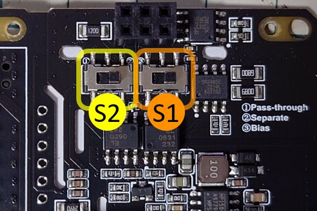

# Module DMX512 for M5Stack

### target devices
 - M5Stack BASIC / GRAY / GO / FIRE
 - M5Stack Core2

### pin map

release ver:

|    |Core1 |Core2 |
|:--:|:----:|:----:|
| TX |  13  |  19  |
| RX |  35  |  35  |
| EN |  12  |  27  |

※ Core1 : BASIC / GRAY / GO / FIRE

---
### Role of switches

 - S1 : BiasResistor for OUT port
 - S2 : Separate or Pass-through
 - S3 : TerminationResistor for IN port

##### S1 : BiasResistor for OUT port
 - OUTポートにバイアス抵抗を接続するスイッチです。
 - IN側に機器を繋がない場合や、スイッチS2を分離(Separate)構成にしたときにONにします。
 - スイッチが左の位置でバイアス抵抗が接続され、右の位置で無接続になります。

##### S2 : Separate or Pass-through
 - IN-OUTポート間の配線を直結するか、分離するかを選択するスイッチです。
 - スイッチが左の位置で直結(Pass-through)構成、右の位置で分離(Separate)構成になります。
 - 直結(Pass-through)構成にした場合、INポートから入力された信号はそのままOUTポートから出力されます。
 - 直結(Pass-through)構成時、INポートからの信号入力中にDMXモジュールから信号出力をすると、OUTポート側の機器が誤動作する可能性があります。
 - 分離(Separate)構成にした場合、INポートとOUTポートは独立したDMX信号となるため、M5Stackを使用して信号を中継する必要があります。
 - 分離(Separate)構成時、RDM規格に対応した機器からの返信信号をOUTポート側からINポート側に中継することはできません。
 - RDM規格に対応した機器を使用する場合は、直結(Pass-through)構成を選択してください。

##### S3 : TerminationResistor for IN port
 - INポートに終端抵抗を接続するスイッチです。
 - スイッチが上の位置で終端抵抗が接続され、下の位置で無接続になります。
 - OUT側に機器を繋がない場合や、スイッチS2で分離(Separate)構成にしたときにONにします。

---
There is currently no official M5Stack library for the DMX512 module. 
We recommend using the [esp_dmx](https://github.com/someweisguy/esp_dmx) library.

[someweisguy/esp_dmx](https://github.com/someweisguy/esp_dmx)

### sample application.
 - [DMX512Tools](examples/DMX512Tools/)

